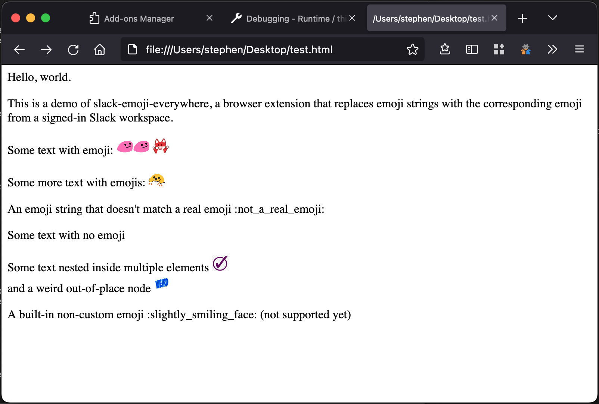

# slack-emoji-everywhere

**⚠️ WIP: This is very much a work in progress/proof of concept and is in no way ready for general use (and may never be).**

Wouldn't it be great if you could use Slack emoji on Workplace by Meta, or any other site? Yes, yes it would.

This alpha-quality extension uses a signed-in Slack workspace to automagically download emoji and injects them into non-Slack webpages in place of text `:emoji:` tokens.

## Architecture

- `options.js`: Add-on settings
- `background.js`: A background script that communicates with Slack
  - Background scripts are allowed to subvert CORS, which would make it impossible for javascript running on another page to communicate directly with Slack
- `not-slack.js`: A content script that runs on non-Slack pages to insert emoji
- Emoji are downloaded using the undocumented (publically, at least) API that the Slack web client uses.
- API requests are authenticated using the logged-in user's cookie token: a token that is only valid when sent in combination with the session cookie

## Installation

`zip slack-emoji-everywhere.xpi *` then load as a temporary add-on. Add the Slack workspace URL to the add-on preferences then open Slack at least once to load the auth info.

## Browser compatibility

Currently only compatible with Firefox, but I believe all that needs to be done to get it working with Chrome is add a polyfill to choose the [`browser` or `chrome` namespace](https://bugs.chromium.org/p/chromium/issues/detail?id=798169) as appropriate.

## Demo

```html
<html>
<body>
  <p>Hello, world.</p>
  <p>This is a demo of slack-emoji-everywhere, a browser extension that replaces emoji strings with the corresponding emoji from a signed-in Slack workspace.</p>
  <p>Some text with emoji: :partyblob::partyblob: :yay:</p>
  <p>Some more text with emojis: :blobexcited:</p>
  <p>An emoji string that doesn't match a real emoji :not_a_real_emoji:</p>
  <p>Some text with no emoji</p>
  <div><div><div>Some text nested inside multiple elements :check-mark:</div></div>and a weird out-of-place node :weird:</div>
  <p>A built-in non-custom emoji :slightly_smiling_face: (not supported yet)</p>
</body>
</html>
```

becomes...



A post on Workplace:


## To do

There are many things left to do to make this usable, some of which are tagged with `TODO` in the code.

Other ideas:

- Add support for non-custom emoji (the Slack client downloads a big blob of all their names rather than getting them through the search API).
- Re-run the logic in the non-Slack content script when the page content is updated
- Add a setting to enable emojification on a per-site basis
- Implement an emoji picker for editible text, like Slack's (use the `emoji/search` API)
