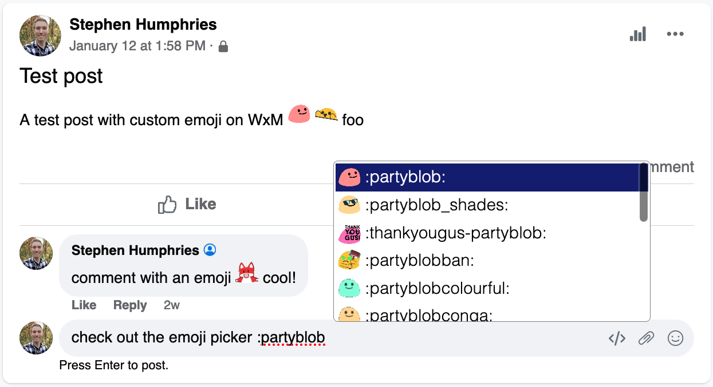

# slack-emoji-everywhere

Wouldn't it be great if you could use Slack emoji on Workplace by Meta, or any other site? Yes, yes it would.

This extension uses a signed-in Slack workspace to automagically download emoji and injects them into non-Slack webpages in place of text `:emoji:` tokens.

## Architecture

- `options.js`: Add-on settings.
  - The extension doesn't request permissions for any sites other than Slack automatically. A user can add sites to the extensions watch list from the options page.
- `slack.js`: A content script that runs on app.slack.com to extract the user's auth token and save it to the extension's local storage where `background.js` can read it.
- `background.js`: A background script that communicates with Slack.
  - Background scripts are allowed to subvert the same-origin policy, which would make it impossible for javascript running on another page to communicate directly with Slack.
- `emoji.js`: A content script that runs on non-Slack pages to insert emoji.
  - Injects emoji once on page load, then monitors the DOM for updates to inject new emoji as needed.
  - Watches contenteditable nodes, textareas, and input[type=text] elements for emoji entry and displays an emoji picker.
- Emoji are downloaded using the undocumented (publically, at least) API that the Slack web client uses.
- API requests are authenticated using the logged-in user's cookie token: a token that is only valid when sent in combination with the session cookie.

## Installation

Development dependencies:
- `npm` and `webpack` to generate JavaScript bundles
- `zip` to package the extension for Firefox
- `chrome` or `chromium` to package the extension for Chrome

Run `npm install` to build the extension.

In Firefox, load `build/slack-emoji-everywhere.xpi` as a temporary add-on via the "Debug add-ons" page. Click "Reload" on that page to update the add-on after its been rebuilt.

In Chrome, you can drag and drop `build/slack-emoji-everywhere.crx` into the extensions page, but it's better to simply enable developer mode then click "Load unpacked" to inst,all the addon from the `build/chrome` directory. That way you can click "Update" to re-install the add-on after its been rebuilt.

Open the add-on preferences to select a Slack workspace and configure site match patterns.

## Browser compatibility

Compatible with with Firefox and Chrome/Chromium. Getting it working on other browsers that support WebExtensions shouldn't be too hard...

## Demo

```html
<html>
<body>
  <p>Hello, world.</p>
  <p>This is a demo of slack-emoji-everywhere, a browser extension that replaces emoji strings with the corresponding emoji from a signed-in Slack workspace.</p>
  <p>Some text with emoji: :partyblob::partyblob: :yay:</p>
  <p>Some more text with emojis: :blobexcited:</p>
  <p>An emoji string that doesn't match a real emoji :not_a_real_emoji:</p>
  <p>Some text with no emoji</p>
  <div><div><div>Some text nested inside multiple elements :check-mark:</div></div>and a weird out-of-place node :weird:</div>
  <p>A built-in non-custom emoji :slightly_smiling_face: (not supported yet)</p>
</body>
</html>
```

becomes...


A post on Workplace, showing off the emoji picker:



Configuration:


## Custom API support

Can't or don't want to use Slack to host custom emoji? `slack-emoji-everywhere` supports fetching emoji info from a custom API server. See [custom-api.md](custom-api.md).

## To do

- Add support for native emoji (the Slack client downloads a big blob of all their names rather than getting them through the search API).
  - I haven't implemented this yet because it requires some thinking about the UX.
    - Should the emoji picker insert real Unicode emoji characters, or just the human-readable `::` names?
    - In the first case, would users be confused by having two types of emoji that are treated differently?
    - In the second, would this too much degrade the experience of people _not_ using the extension?
  - At the moment, I'm inclined to just not touch native emoji at all and have users use their OS's native picker to type them. This keeps it perfectly clear which emoji are native and which are custom. Considering we don't have the luxury Slack has of being able to blur the lines between types, this seems like an acceptable balance. (On the other hand, users may find it annoying...)
